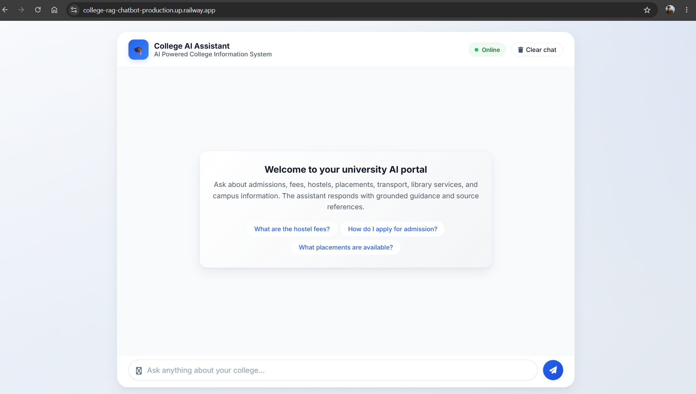
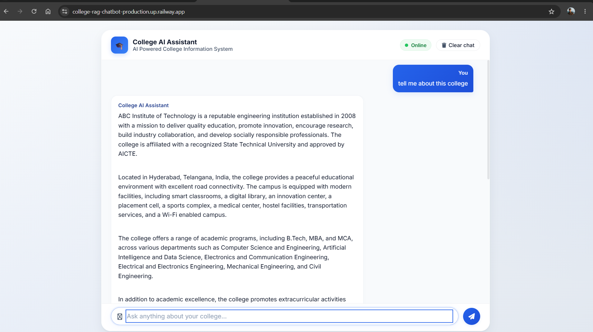
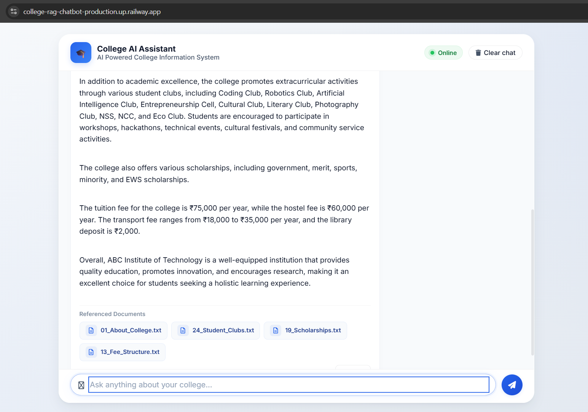
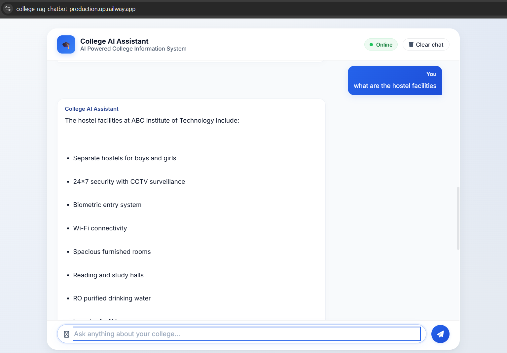
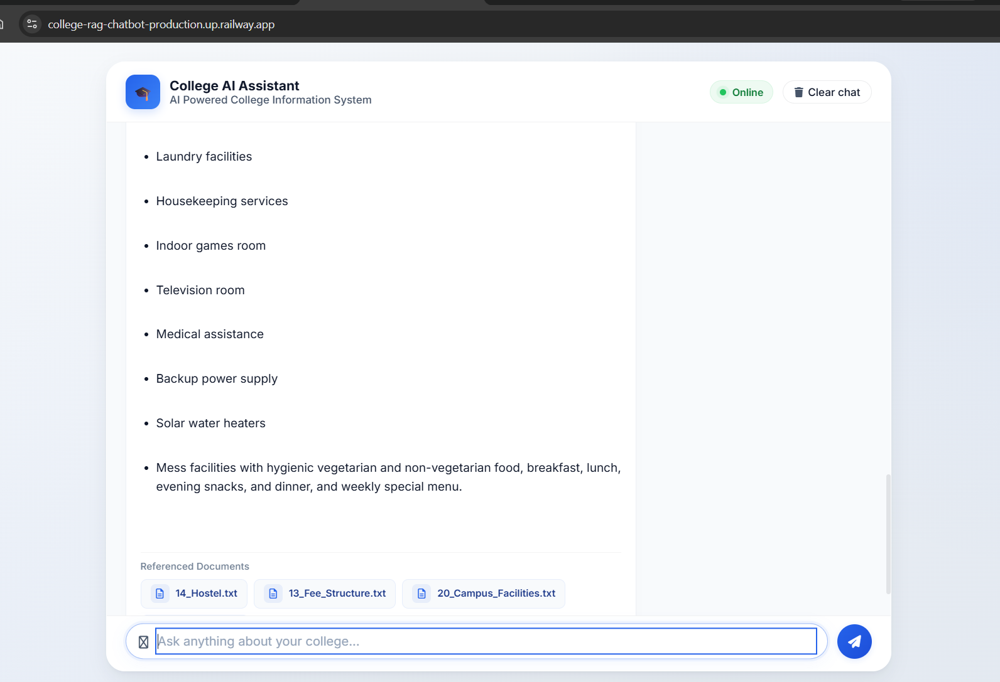

# 🎓 College AI Assistant

An AI-powered College Information Assistant built using **Retrieval-Augmented Generation (RAG)**. The application enables users to ask natural language questions about a college and receive accurate, context-aware responses generated from institutional documents using **LangChain**, **ChromaDB**, **HuggingFace Embeddings**, and the **Groq LLM**.

---

## 🚀 Live Demo

🌐 Live Application: https://college-rag-chatbot-production.up.railway.app/

📂 GitHub Repository:
https://github.com/Nithishreddychaikam/College-RAG-Chatbot

---

# 📖 Project Overview

Traditional chatbots rely on predefined rules or static responses, making them ineffective for answering questions from large document collections.

This project implements a **Retrieval-Augmented Generation (RAG)** pipeline that retrieves the most relevant information from a knowledge base before generating an answer with a Large Language Model (LLM).

The chatbot currently answers questions related to a college using structured TXT and PDF documents, but the architecture is domain-independent and can be adapted for schools, hospitals, universities, companies, banks, or any organization with document-based knowledge.

---

# ✨ Features

- 🤖 AI-powered conversational chatbot
- 📚 Retrieval-Augmented Generation (RAG)
- 🔎 Semantic document search
- 📄 Supports TXT and PDF knowledge bases
- 🧠 HuggingFace Sentence Transformer embeddings
- 💾 ChromaDB vector database
- ⚡ Groq LLM integration
- 📌 Source document references
- 💬 Modern ChatGPT-style interface
- 🌐 Cloud deployment using Railway
- 🔐 Secure API key management using environment variables

---

# 🏗️ System Architecture

```
                User Question
                      │
                      ▼
             Flask Web Application
                      │
                      ▼
          HuggingFace Embedding Model
                      │
                      ▼
          ChromaDB Vector Database
                      │
             Semantic Retrieval
                      │
                      ▼
                Relevant Context
                      │
                      ▼
                 Groq LLM
                      │
                      ▼
         AI Generated Response
          + Source References
```

---

# 🛠️ Technology Stack

| Category | Technologies |
|----------|--------------|
| Programming Language | Python |
| Backend | Flask |
| LLM Framework | LangChain |
| Vector Database | ChromaDB |
| Embedding Model | sentence-transformers/all-MiniLM-L6-v2 |
| Large Language Model | Groq (Llama 3.1 8B Instant) |
| Document Processing | TextLoader, PyPDFLoader |
| Frontend | HTML, CSS, JavaScript |
| Deployment | Railway |
| Version Control | Git & GitHub |

---

# 📂 Project Structure

```
College-RAG-Chatbot/
│
├── app.py
├── config.py
├── requirements.txt
├── README.md
│
├── chroma_db/
│
├── data/
│   ├── *.txt
│   └── *.pdf
│
├── scripts/
│   └── create_vector_db.py
│
├── static/
│   ├── style.css
│   └── script.js
│
├── templates/
│   └── index.html
│
└── utils/
    └── rag_engine.py
```

---

# ⚙️ Installation

## Clone Repository

```bash
git clone https://github.com/Nithishreddychaikam/College-RAG-Chatbot.git
```

---

## Navigate to Project

```bash
cd College-RAG-Chatbot
```

---

## Create Virtual Environment

```bash
python -m venv .venv
```

---

## Activate Environment

### Windows

```bash
.venv\Scripts\activate
```

### Linux / macOS

```bash
source .venv/bin/activate
```

---

## Install Dependencies

```bash
pip install -r requirements.txt
```

---

## Configure Environment Variables

Create a `.env` file.

```
GROQ_API_KEY=YOUR_GROQ_API_KEY
```

---

## Build Vector Database

```bash
python -m scripts.create_vector_db
```

---

## Run Application

```bash
python app.py
```

Open:

```
http://127.0.0.1:5000
```

---

# 💬 Sample Questions

- Tell me about this college.
- What courses are offered?
- Explain the admission process.
- What are the hostel facilities?
- What is the fee structure?
- What sports facilities are available?
- What scholarships are available?
- Where is the college located?

---

# College AI Assistant (RAG Chatbot)

## 🚀 Live Demo

https://college-rag-chatbot-production.up.railway.app/

## ✨ Features

- Retrieval-Augmented Generation (RAG)
- Chroma Vector Database
- Groq LLM
- Flask Backend
- Responsive UI

## 📸 Project Screenshots

<h3>🏠 Home Page</h3>

<p align="center">
  
</p>

<h3>💬 College Overview</h3>

<p align="center">
  
  
</p>

<h3>🏨 Hostel Facilities</h3>

<p align="center">
  
  
</p>

## 🛠️ Tech Stack

...
# 🔮 Future Enhancements

- Document upload through the web interface
- OCR support for scanned PDFs
- Multi-user authentication
- Conversation memory
- Streaming responses
- Support for DOCX and Excel documents
- Admin dashboard
- Multi-organization knowledge bases

---

# 🎯 Learning Outcomes

Through this project, I gained practical experience in:

- Retrieval-Augmented Generation (RAG)
- LangChain
- Prompt Engineering
- Vector Databases
- Semantic Search
- LLM Integration
- HuggingFace Embeddings
- Flask Web Development
- Cloud Deployment
- Git & GitHub

---

# 👨‍💻 Author

**Chaikam Nithish Reddy**

GitHub:
[https://github.com/Nithishreddychaikam](https://github.com/Nithishreddychaikam/College-RAG-Chatbot)

LinkedIn:
(https://www.linkedin.com/in/chaikam-nithishreddy-301b31379/)

---

# 📄 License

This project is developed for educational and portfolio purposes.
